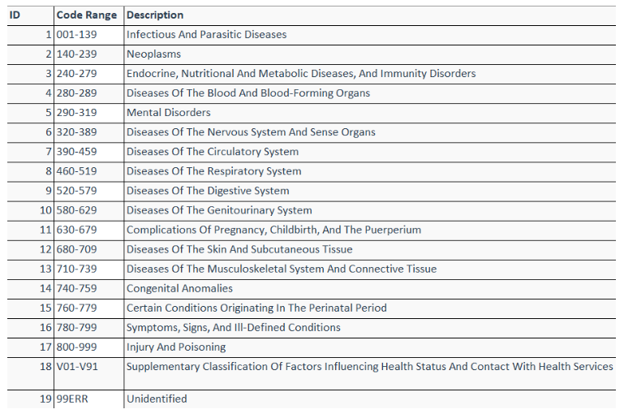
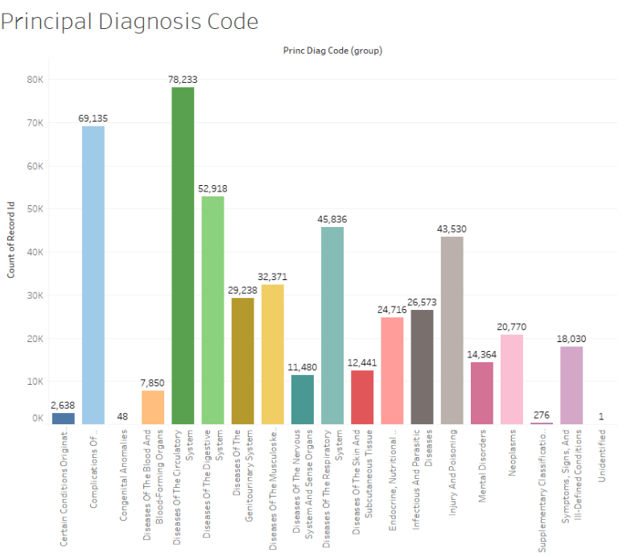
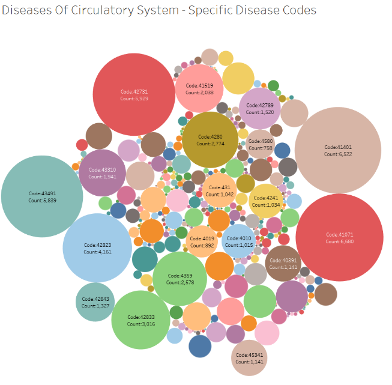
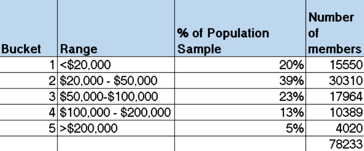
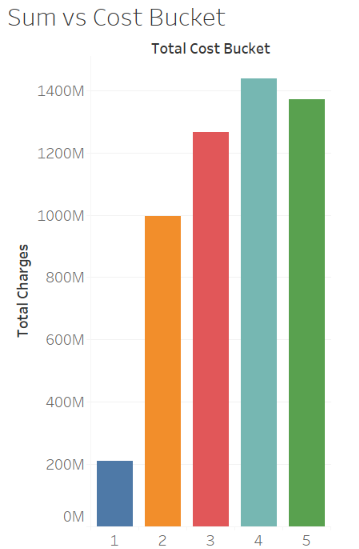
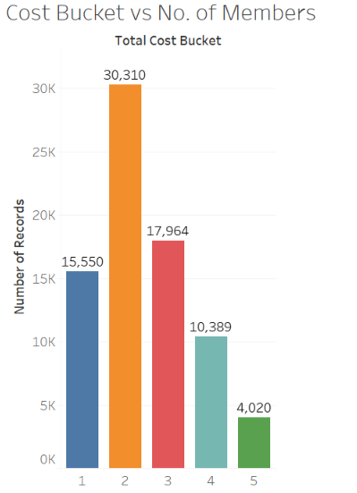

# Heathcare Cost Prediction
## Predict Patient Healthcare Cost with Morbidity Measures & Demographics
This mining problem enables the healthcare management system manage patients and related utilities efficiently. An important informatics tool for controlling healthcare costs is accurately predicting the likely future healthcare costs of individuals.  For health insurers and increasingly healthcare delivery systems, accurate forecasts of likely costs can help with general business planning in addition to prioritizing the allocation of scarce care management resources. Moreover, for patients, knowing in advance their likely expenditures for the next year could potentially allow them to choose insurance plans with appropriate deductibles and premiums.

## Tools Used
- Tableau
- SAS Enterprise Miner
- Tibco Spotfire

## Preliminary Exploratory Data Analysis
Our dataset consists of 719370 unique patient records with payment details. The available data includes demographic information (e.g. age, gender, race, ethnicity), clinical location details (county, health region, state, zip, etc.), severity and diagnosis details (pat_status, risk_mortality, illness_severity, admitting_diagnosis, etc.) and finally cost information (total charges, accommodation charges, non-covered accommodation charges, ancillary charges, noncovered ancillary charges, etc.). Our selected 10 initial input variables are SOURCE_OF_ADMISSION, TYPE_OF_ADMISSION, SEX_CODE, RACE, ETHNICITY, PAT_AGE, FIRST_PAYMENT_SRC, TYPE_OF_BILL, PRINC_DIAG_CODE and ILLNESS_SEVERITY.

The below ICD9 codes are classified based on causes as below. In the 5 digit ICD9 code first three digits form the category of the disease, 4th digit forms the cause of the disease and the 5th digit signifies the location of disease. ICD-9-CM contains a list of codes corresponding to diagnoses and procedures recorded in conjunction with hospital care in the United States. These codes may be entered onto a patient's electronic health record and used for diagnostic, billing and reporting purposes. Related information also classified and codified in the system includes symptoms, patient complaints, causes of injury, and mental disorders.

We classified the about Principal Diagnosis Code into groups or buckets of category information as listed above. Thus forming 19 categories and 1 category as undefined. When we plotted the count of Principal Diagnosis Code Group we obtained below results. We identified there were majority of diseases in “Diseases of Circulatory System” (460-519 ICD9 codes) category with count of 78,233 records. Thus this can be considered as the most common category based on the dataset. “Complications Of Pregnancy, Childbirth, And The Puerperium” is the second most common with 69,135 records.

On plotting the specific diseases of “Diseases of Circulatory System” we get below plot. Code - 41071 is the most common disease which has 6680 records which is “Myocardial Infarction”. The second most common disease is code - 41401 “Coronary atherosclerosis of native coronary artery” which has 6522 records. And the third most common disease is code- 42731 “Atrial fibrillation” which has 5929 records. The other diseases to follow are: “Cerebral artery occlusion”(43491), “Acute on chronic systolic heart failure”(42823), “Acute on chronic diastolic heart failure” (42833).

## Cost Bucketing
To reduce the noise in the data as well as reduce the effect of extremely expensive members we partition the cost into buckets. 

When we plot the Cost Buckets 1 to 5 against the sum of total charges we get the above graph. This means that the highest charges is in the 4th cost bucket. However, 2nd bucket forms the highest number of members i.e. 30310 which is 39% of the entire population. 

   
